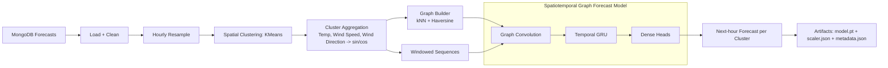

# WeatherService.ModelAI

This module trains a spatiotemporal model that forecasts hourly temperature, wind speed, and wind direction for clustered geographic zones. It uses clustering to define zones, a graph to model spatial influence between nearby zones, and a temporal sequence model to capture weather evolution over time.

## Recommended Architecture

**Spatiotemporal Graph + GRU (Graph Convolution → GRU → Dense).**

- **Spatial structure:** Cluster lat/lon points into zones, then create a graph using k-nearest neighbors and Haversine distance.
- **Temporal structure:** Use a GRU over hourly sequences to capture evolution.
- **Wind direction handling:** Convert direction to sine/cosine so circularity is modeled correctly.

## Architecture Diagram

## Training Pipeline

The pipeline is implemented in [WeatherService.ModelAI/train_pipeline.py](WeatherService.ModelAI/train_pipeline.py).

Key steps:

1. Load weather observations from MongoDB.
2. Cluster lat/lon coordinates into spatial zones.
3. Aggregate observations by zone and hour.
4. Build adjacency between nearby zones.
5. Train a graph-temporal model to predict next-hour conditions.
6. Save artifacts for later inference.

## Training Progress and Loss

The pipeline logs training progress to stdout. You will see output like:
`Epoch 1/20 (5.00%) | Train Loss: 0.962426 | Val Loss: 1.065235`

- **Train Loss**: The prediction error on the training dataset.
- **Val Loss**: The prediction error on the validation dataset (unseen data).
- **Interpretation**:
  - High loss that decreases rapidly indicates the model is learning.
  - If Val Loss stops decreasing or increases while Train Loss decreases, the model is overfitting.
  - The model uses MSE (Mean Squared Error). A value around 1.0 (after scaling) prevents extreme errors but suggests further tuning or more data might be needed for high precision.

## Artifacts

The training run writes to `/app/artifacts` by default (mapped to local `./model_artifacts` in `docker-compose`):

- `model.pt` – PyTorch model weights and config
- `scaler.json` – feature standardization stats
- `metadata.json` – cluster centers and adjacency matrix

These artifacts **should strictly be ignored** in version control (added to `.gitignore`).

## Running in Docker

From the repo root:

- Build:
  - `docker build -f WeatherService.ModelAI/Dockerfile -t weather-model-ai .`

- Run:
  - `docker run --rm -e MONGO_URI=mongodb://host.docker.internal:27017 -e MONGO_DB=WeatherDb -e MONGO_COLLECTION=Forecasts -v $(pwd)/artifacts:/app/artifacts weather-model-ai`

## Configuration (Environment Variables)

- `MONGO_URI` (default: `mongodb://mongo:27017`)
- `MONGO_DB` (default: `WeatherDb`)
- `MONGO_COLLECTION` (default: `Forecasts`)
- `NUM_CLUSTERS` (default: `64`)
- `K_NEIGHBORS` (default: `6`)
- `INPUT_WINDOW` (default: `24`)
- `TRAIN_SPLIT` (default: `0.8`)
- `EPOCHS` (default: `20`)
- `BATCH_SIZE` (default: `32`)
- `LEARNING_RATE` (default: `1e-3`)
- `MAX_RECORDS` (default: `0`, unlimited)
- `START_DATE` / `END_DATE` (optional filters, ISO 8601)
- `ARTIFACTS_DIR` (default: `/app/artifacts`)

## Notes

- Wind direction is modeled as sine/cosine components to preserve circular geometry.
- The graph convolution uses normalized adjacency with self-loops so nearby clusters influence each other.
- The model predicts the next-hour values for each cluster; for multi-step forecasting, iterate predictions.
